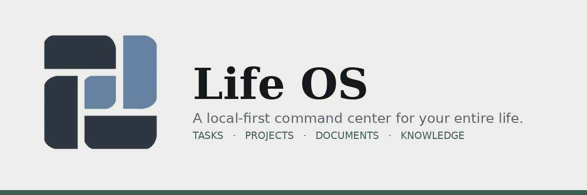

# Life OS

<p align="center">
  
</p>

<p align="center">
  <a href="https://nodejs.org"></a>
  <a href="https://www.electronjs.org/"></a>
  <a href="https://expressjs.com/"></a>
  <a href="https://react.dev/"></a>
  
  <a href="https://github.com/J0hnWIcks"></a>
</p>

A personal Life Operating System that runs entirely on your own machine — no
Notion, no account, no cloud. It's a local-first app: every byte of data
lives in plain JSON files on your disk. You can run it two ways:

- **As a desktop app** (recommended) — a real double-click icon, no
  terminal, no browser tab. See [Desktop app](#desktop-app) below.
- **As a local web app** — the original way, for hacking on the code.

```
life-os/
├── client/     React + Vite frontend (what you see on screen)
├── server/     Tiny Express backend (reads/writes files in server/data/)
├── electron/   Desktop app wrapper (starts the server, opens a window)
```

## Requirements

- [Node.js](https://nodejs.org) 18 or later (includes `npm`)

## Desktop app

This turns Life OS into a native app you install once and then just
double-click — no terminal, no "start the server," nothing visible under the
hood. Under the hood it's still the exact same Express server and JSON files;
Electron just packages it with its own copy of Chromium and starts/stops the
server for you automatically.

**Building the installer is a one-time, one-command step** (this is the
"technical setup," and you only do it once — after that it's just an icon):

```bash
npm run install:all         # installs root + server + client dependencies
npm install                 # double-checks root-level deps (electron, electron-builder) are present
npm run dist                # builds an installer for whatever OS you're on
```

> `npm run install:all` already runs a root `npm install` as its first step, so
> that second `npm install` is normally a fast no-op — it's a good safety net
> if `install:all` ever gets interrupted partway through, and it's harmless to
> run either way.

This produces a `release/` folder containing:
- **macOS**: a `.dmg` — open it, drag Life OS to Applications
- **Windows**: a `.exe` installer — run it, it installs normally
- **Linux**: a `.AppImage` — mark it executable and double-click, or install it however you prefer

Run the matching command if you specifically want one platform's build:
`npm run dist:mac`, `npm run dist:win`, or `npm run dist:linux`. Note that
electron-builder can only reliably build a macOS `.dmg` on a Mac (Apple's
tooling isn't available elsewhere) — build on the OS you want to target.

From then on, Life OS is a normal app on your machine: double-click the icon,
a window opens, you use it, you close the window when you're done. Your data
is stored per-user in the OS's standard app-data location (e.g. `~/Library/
Application Support/Life OS/data` on macOS, `%APPDATA%\Life OS\data` on
Windows, `~/.config/Life OS/data` on Linux) — not inside the app bundle — so
it survives reinstalls/updates and is easy to find for backups. Everything
still runs 100% locally; nothing about packaging it as a desktop app changes
what leaves your machine (still only the two opt-in integrations you can
turn on in Settings: Google Calendar sync and the bring-your-own-key Support
chat).

To hack on the app itself with the desktop shell (hot reload included):

```bash
npm run electron:dev
```

## Running it as a local web app (original method)

If you'd rather not install anything platform-specific and are fine with a
terminal + browser tab:

```bash
npm run install:all
npm run dev
```

This starts the backend on `http://localhost:4310` and the frontend on
`http://localhost:5173`. Open **http://localhost:5173** in your browser —
that's Life OS. Leave the terminal running in the background while you use it;
stop it any time with `Ctrl+C`.

## Where your data lives

Every task, project, document, and note is stored as plain JSON. Nothing
leaves your machine.

- **Desktop app**: your OS's standard per-user app-data folder (see
  [Desktop app](#desktop-app) above for exact paths) in a `data/`
  subfolder — e.g. `~/Library/Application Support/Life OS/data/` on macOS.
- **Local web app**: `server/data/`.

To back up your entire Life OS, just copy that folder somewhere safe (e.g. a
synced Drive/Dropbox folder, or a private git repo) — or use Settings →
**Download backup**, which works the same way in both modes. To reset
everything, close the app and replace the files in that folder with empty
ones (`[]` for lists, `{}` for `dailyLogs.json` and `settings.json`).

## How it's organized

- **Dashboard** — your command center: today's tasks on a 24-hour "Day Ring"
  (drag any task straight onto it to give it a time slot), current projects,
  weather, quote of the day, and what's coming up.
- **Inbox** (⌘K / Ctrl+K anywhere) — a single capture point. Drop anything in
  without deciding where it belongs, then sort it into a Task, Project, Note,
  Document, or Event with one click whenever you're ready.
- **Daily Planner** — goals, priority tasks (drag to reorder, drag onto the
  Day Ring to time-block), recurring tasks (daily/weekly/monthly, with an
  optional end date), and an "accomplished today" list that resets each day
  but keeps history for Analytics.
- **Calendar** — month view of events, deadlines, and task due dates, with
  recurring events/deadlines that keep generating future occurrences on their
  own.
- **Projects** — each one keeps its own goals, tasks, milestones, links,
  resources, and notes together, with progress calculated automatically from
  its tasks.
- **Documents** — categorized, tagged, searchable file references (School,
  Personal, Business, Financial, Medical, Legal), with real file attachments
  (PDFs, images, anything) you can upload and download.
- **Knowledge Base** — a separate, searchable second brain for ideas,
  research, and reference material, with a Markdown preview toggle.
- **Tags** — one place to browse everything tagged across Documents and the
  Knowledge Base together.
- **Analytics** — a 14-day completion trend and per-project progress.
- **Weekly Review** — a two-minute Sunday-planning view: what got done this
  week, goals set, reflections written, and which projects moved.
- **Focus** — a Pomodoro-style timer (25/5, 50/10, or 15/3) built around the
  same ring visual as the Dashboard, with a gentle chime and notification
  when a session ends.
- **Support** — an optional, ephemeral AI chat (bring your own free Gemini
  API key) for quick questions. Nothing here is saved once you navigate away.
- **Trash** — anything you delete (tasks, projects, documents, notes, events,
  inbox items) lands here for 30 days before being erased for good. Restore
  it or empty it manually any time.

### Command palette (⌘K / Ctrl+K)

Press it anywhere in the app. Start typing to fuzzy-jump to any page ("go
projects", "week" for Weekly Review), search live across your tasks,
projects, documents, and notes, or just type a thought and hit Enter to drop
it straight into your Inbox — all from the same box.

### Subtasks

Any task in the Daily Planner can be expanded (the chevron on the right of
each row) into its own checklist — useful once a task is really a small
project of its own, like "Pack for trip" → passport, charger, meds.

### Browser notifications

Turn on **Settings → Time-block notifications** to get a quiet browser
notification the moment a time-blocked task's start time arrives. This only
fires while the app is open in a tab — it's not a background service.

### Recurring tasks & events

Setting a task or event to repeat (daily/weekly/monthly) generates real,
individually-completable instances up to 90 days ahead. The app tops up
future instances automatically each time the server starts (and every 6
hours it stays running), so you never run out as long as you open it
periodically. Deleting one instance only removes that day; "stop repeating"
removes that occurrence and everything after it, while preserving past
history for Analytics and the Weekly Review.

### Appearance & quotes

Settings has four color themes (Meadow, Midnight, Slate, Sand) that reskin
the whole app instantly. The daily quote pulls from 20 built-in quotes plus
any you add yourself in Settings — it looks random but stays fixed for the
whole day so it doesn't change every time you refresh.

### File backups

Settings → **Download backup** zips your entire `server/data/` folder
(including uploaded document files) for one-click download, any time.

### Mobile

On a narrow screen (phone, tablet), the sidebar collapses behind a menu
button in the top-left, and every page's layout stacks vertically. Since
this only runs on the machine it's installed on, checking it from your phone
requires that phone to be on the same wifi network — visit
`http://<your-computer's-local-IP>:5173` from the phone's browser (you'll
also need to run `npm run dev -- --host` in `client/` instead of the usual
`npm run dev` so Vite accepts connections from other devices).

## Support / AI assistant setup

1. Get a free key at [aistudio.google.com/apikey](https://aistudio.google.com/apikey) (no credit card required).
2. Paste it into Settings → Support — AI assistant.
3. Open the **Support** page and ask away.

The key is stored only in your local `server/data/settings.json` and used
directly from your browser to call Google's Gemini API — it never passes
through any other server. Conversations aren't saved; refreshing or leaving
the page clears them.

## Google Calendar setup (read-only sync)

This pulls your existing Google Calendar events into the Calendar page
(read-only — nothing created here ever gets pushed back to Google). It needs
your own free OAuth client, since a shared one can't be safely embedded in a
local app:

1. Go to [Google Cloud Console](https://console.cloud.google.com/) and create a new project (or use an existing one).
2. **APIs & Services → Library** → search for "Google Calendar API" → Enable it.
3. **APIs & Services → OAuth consent screen** → choose "External," fill in the required fields (app name, your email). You can leave it in "Testing" mode — add your own Google account under "Test users" so it's allowed to sign in.
4. **APIs & Services → Credentials → Create Credentials → OAuth client ID** → Application type: **Web application**.
5. Under "Authorized redirect URIs," add exactly:
   ```
   http://localhost:4310/api/google/callback
   ```
6. Save, then copy the **Client ID** and **Client Secret** it gives you.
7. In Life OS, go to **Settings → Google Calendar**, paste both in, and click **Connect Google Calendar**. Approve access in the Google consent screen that opens — you'll land back on Settings, connected.

Your events (last 30 days through next 6 months) will now show up on the
Calendar page with a Google badge, alongside your local events. They're
read-only here — edit them in Google Calendar itself. Disconnect any time
from the same Settings section.

## Integrations note (free-tier reality check)

Google Drive and GitHub aren't wired up the same way Google Calendar is —
both would need their own OAuth setup and API work similar to what's above.
The practical stand-in used here: **Documents** and **Projects** both support
a plain URL field, so you can paste a link to a Google Doc, Drive folder, or
GitHub repo/issue right where you need it. If you want real Drive or GitHub
sync later, that follows the same pattern as the Google Calendar integration
above — ask and it can be added.

## Customizing it

This is your codebase now. A few easy starting points:

- Colors and fonts: `client/src/index.css` (the `@theme` block)
- Add a new page: create a file in `client/src/pages/`, add a route in
  `client/src/App.tsx`, add a link in `client/src/components/Sidebar.tsx`
- Add a new data type: add a collection name to `ARRAY_COLLECTIONS` in
  `server/index.js` and a type in `client/src/types.ts`

## Credits

Built by **Joseph Blake Von Jett** — [github.com/J0hnWIcks](https://github.com/J0hnWIcks)


